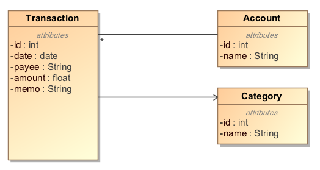

# Manage My Money

_Manage My Money_ is a moderately complex application to demonstrate best
practices in testing. Most examples on the net are either too simple or focused
on a single aspect of testing. I wanted to create something more realistic that
touched on several aspects of testing including unit tests, integration tests
and end-to-end tests. In addition I wanted to demonstrate the power of
Behavior-Driven Development (BDD) for specifying requirements that also serve as
acceptance tests. This repo is the result of that ambition. Hope you will find
it useful. [Feedback welcome!](https://twitter.com/NareshJBhatia)

## The Application

Manage My Money is a personal finance manager that allows you to record and
analyze your income and expenses. Here are a few screenshots to give you an
idea:

## Domain Concepts

The diagram below shows the domain model of our application:

The goal of Manage My Money is to record financial transactions. A transaction
has the following attributes:

| Name   | Description                                                  |
| ------ | ------------------------------------------------------------ |
| id     | A unique identifier                                          |
| date   | Transaction date                                             |
| payee  | The other party in the transaction                           |
| amount | Transaction amount (income is positive, expense is negative) |
| memo   | An optional note or description                              |

In addition, every transaction is associated with an account (e.g. a bank
account or a credit card account) and a category (e.g. Groceries, Shopping,
Salary, Taxes etc.).

## Server

The [server implementation](./mmm-server) uses Node.js and PostgreSQL. It
exposes a REST API. We use Docker to make the installation easier. You can find
installation instructions in the README file.

## Client

The [client implementation](./mmm-client) uses React. You can find installation
and testing instructions in the README file.
